### **THE ANALYZED FILE**

##### 

* **In this analysis, 'Just' PCAP file was used!   EML and ZIP files weren't needed;**

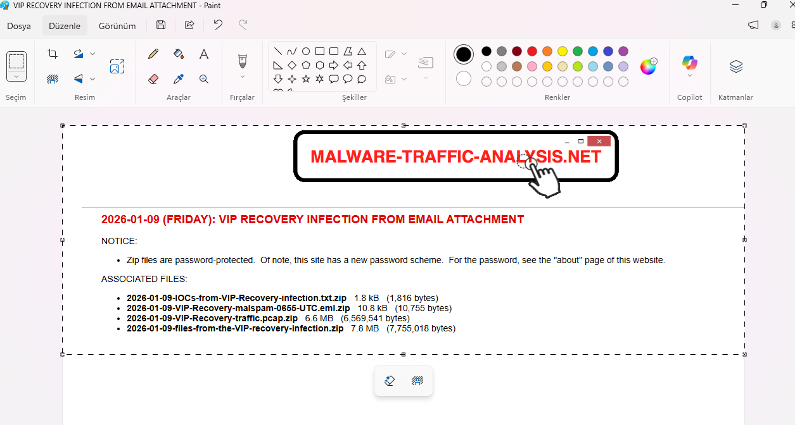

**\*Shape 1: downloaded source files in malware-traffic-analysis.net - 'Just' PCAP file was used\***

**1.Protocol Hierarchy was used to understand the structure of the traffic**

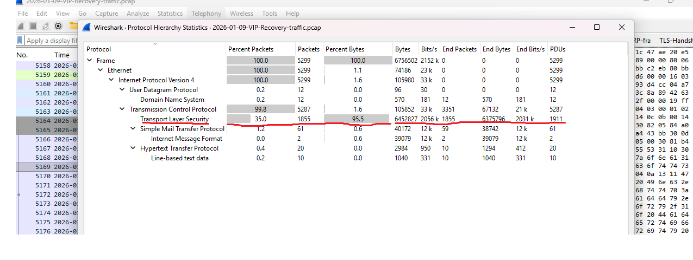

**Well, in here we are seeing that there are high volumes of TLS packets and Bytes(6452827-%95 of total traffic) ! (there may be downloaded malware)!**

**\*TLS is used to encrypt to files.**

**2. Conservations was used to detect for high volume host (10.1.9.101)**

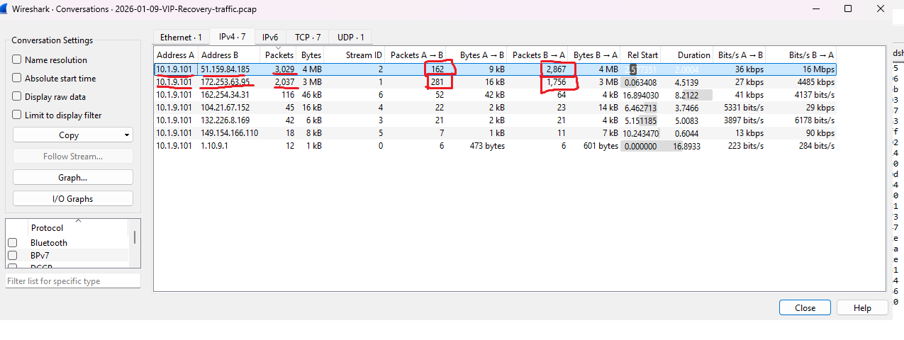

**\*in checking conservations the goal is for seeing which ip has higher packets between each other**

**\*But if there is high volume of TLS, we have to check name resolution;**

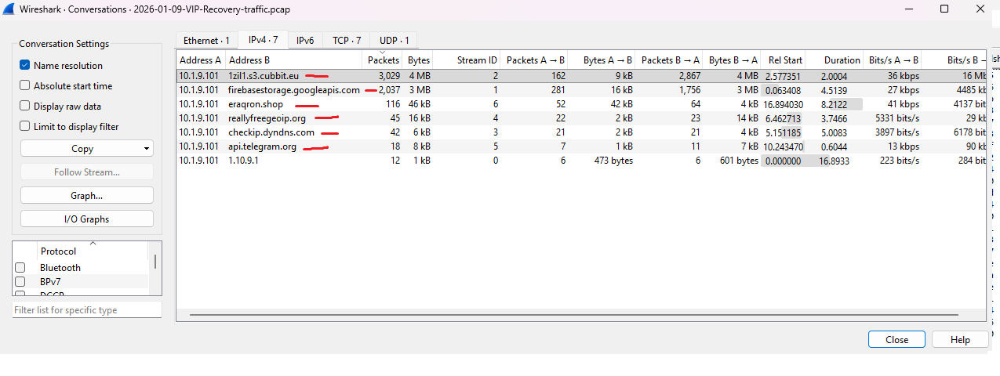

**Well ,there may be malicious link(IP'S) ! Let's check :)**
1. **51.159.84.185(this ip is clear looking like clear)  - 1zil1.s3.cubbit.eu  4 MB**
2. **172.253.63.95(this ip is looking like clear) - firebasestorage.googleapis.com 3 MB**
3. **162.254.34.31 - eraqron.shop ( 11/93 security vendors flagged this IP address as malicious )**
4. **104.21.67.152 - reallyfreegeoip.org (it's clear)**
5. **132.226.8.169 - checkip.dyndns.com ( 1/93 security vendor flagged this IP address as malicious )**
6. **149.154.166.110 - api.telegram.org (1/93 security vendor flagged this IP address as malicious)**

**There is result of VirusTotal. But we can't be sure %100 results of VirusTotal. By that we have to analysis in Traffic now. First step; to check (51.159.84.185, 172.253.63.95) on whatismyipaddress.com. Our goal is to find the cloud provider behind these IPs. And we couldnt find anything also in there.**

**But if we will search 51.159.84.185 as link (1zil1.s3.cubbit.eu) in virustotal**

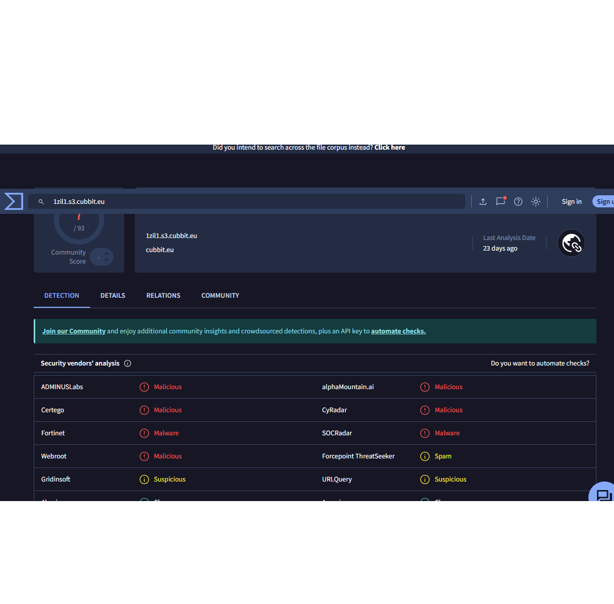

**We are seeing that link is 7/93 security vendors flagged this domain as malicious**

**In the same way if we will search 172.253.63.95 as link 'firebasestorage.googleapis.com'**

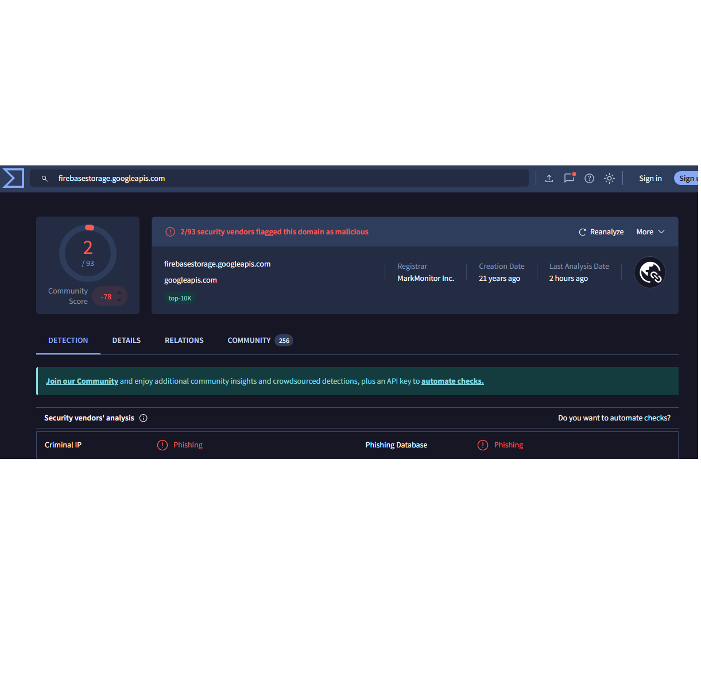

**Result of thats link is 2/93 security vendors flagged this domain as malicious**

**"IPs are clean, domains are malicious. This indicates an IP rotation strategy: So the attacker is changing IPs, not the domain. "**

**3. ENDPOINTS was used to see the data of traffic between IPs**

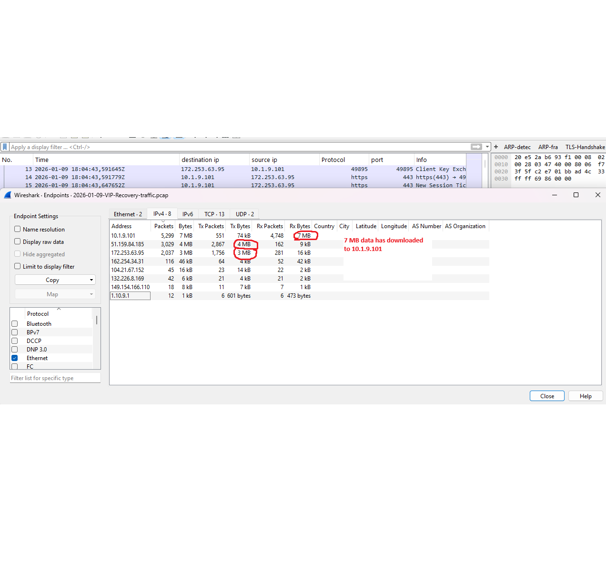

**4 mb data was sent by 51.159.84.185 '1zil1.s3.cubbit.eu' to 10.1.9.101**

**3 MB data was downloaded 172.253.63.95 'firebasestorage.googleapis.com' to 10.1.9.101**

**4. Time to check traffic of '172.253.63.95' in wireshark**

**When we start checking packets from first packet, we can see a handshake on (HTTPS)443 and 49895 between 172.253.63.95 and 10.0.9.101 at 18:04:43 2026-01-09.**

**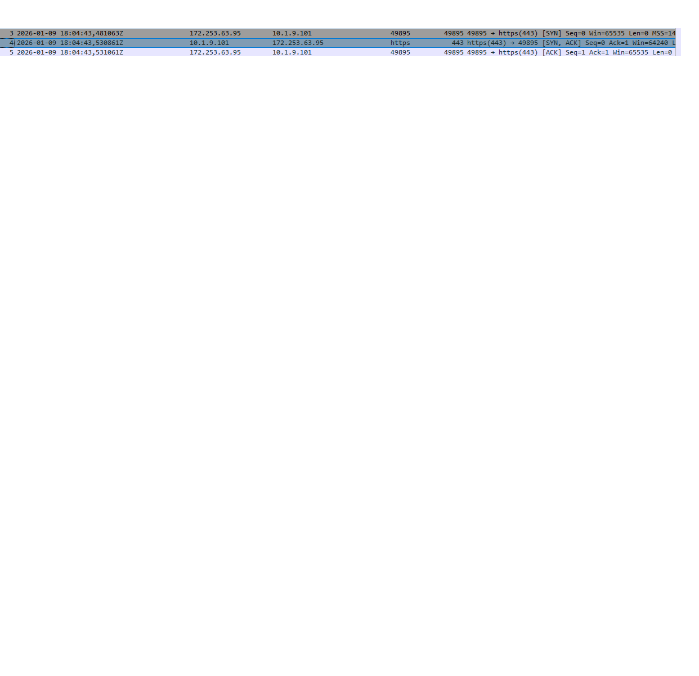**

**well we can write on filter ip.src==172.253.63.95 and ip.dst == 10.1.9.101 \&\& tcp.port == 443**

**Note : This filter shows all HTTPS traffic to the victim (10.1.9.101) from Firebase (172.253.63.95).**

**We already know from the Endpoints table that 3 MB of data was sent to 10.1.9.101 from this IP. Now, let's see when and how fast it happened.**

**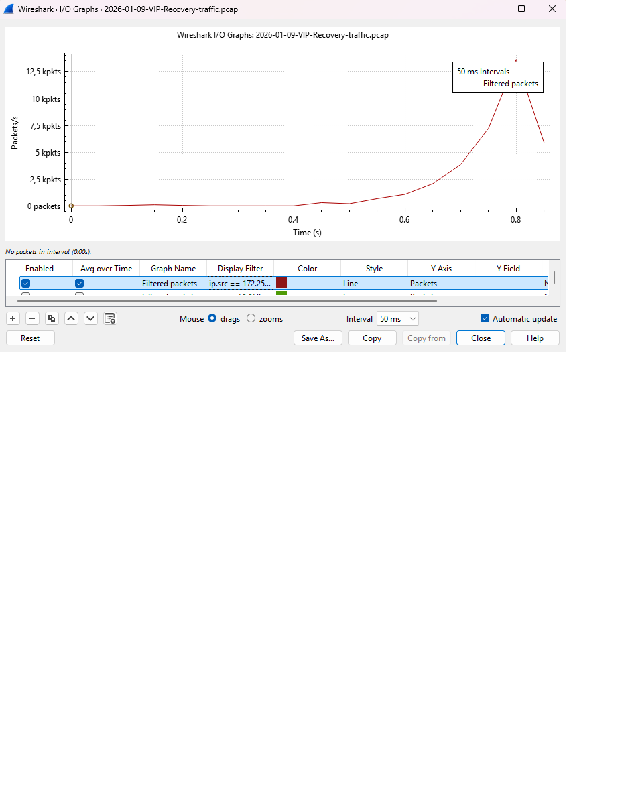**

**The graph shows a massive spike of 1500+ packets/second at the moment of infection.**

**This is not normal web traffic – it's a file download.**

**- Source: 172.253.63.95 (firebasestorage.googleapis.com)**

**- Destination: 10.1.9.101 (Victim)**

**- Peak rate: 1500+ packets/second at 18:04:43**

**- Duration: ~1 second**

**- Total data: 3 MB (confirmed by Endpoints)**

**This is the exact moment the first-stage malware was downloaded.**

**If we use the filter ip.addr == 172.253.63.95, we can see last packet of this IP.(Time is the most important factor for us to analyze the infection timeline.). The last packet from this IP is 2038 at 18:04:44**

**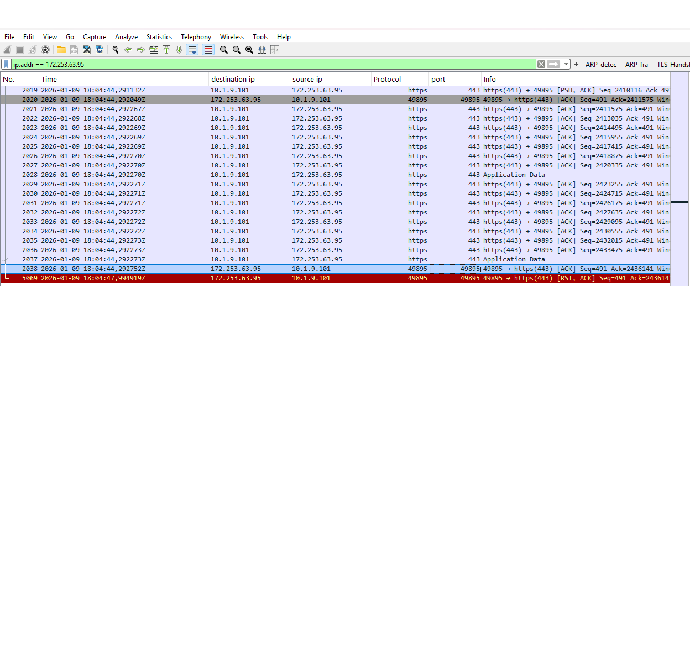**

**You might wonder about packet 5069! Let me explain; There is a 3-second gap between packet 2038 and packet 5069.**

**5069  18:04:47  RST, ACK  Connection closed ( well, it means that connection was forcefully closed with RST packet). we have to check another packets to understand this event.**

**5. Time to check traffic of '51.159.84.185' in wireshark**

**At packet 2039, we see that 51.159.84.185 '1zil1.s3.cubbit.eu' wants connect to Host(10.1.9.101)**

**[Connection of 51.159.84.185](images/handshake2.png)**

**In the view, we see a handshake on 49896 and 443 (HTTPS) ports between host and 51.159.84.185**

**When I use the filter 'ip.src== 51.159.84.185 and ip.dst == 10.1.9.101 and tcp.port == 443', I see that the second file (4 MB, confirmed by Endpoints) started downloading at 18:04:46. The first download finished at 18:04:44, and just 2 seconds later, at 18:04:46, the second download began. And second download finished at packet 5067 at 18:04:47. that's only 1 second!**

**Let me explain with I/O Graphs ;**

**First Download Detail (ip.src == 172.253.63.95)**

**[First Download](images/spike1.png)**

**3 MB download from firebasestorage.googleapis.com, peak speed 200 packets/second.**

**Second Download Detail (ip.src == 51.159.84.185)**

**[Second Download](images/spike2.png)**

**4 MB download from cubbit.eu, peak speed ~100 packets/second.**

**Overall Traffic to Victim (ip.dst == 10.1.9.101)**

**[Overall Traffic](images/iographs-host.png)**

**Two large file downloads within 4.3 seconds.**
**Second Download finished at 5067 packet and at 5069 connection of 172.253.63.95 and 51.159.84.185 was forcefully closed with RST packet at 18:04:49.**

**[Forcefully closed](images/RST.png)**

**132.226.8.169 ip connected to host(10.1.9.101) poty 80(HTTP) at 18:04:49. If we write the filter ' ip.src ==132.226.8.169 and ip.dst == 10.1.9.101 and tcp.port == 80' and if we check inside of packets. and inspecting the packet contents, we see: '<html><head><title>Current IP Check</title></head><body>Current IP Address: 173.66.46.97</body></html>\\r\\n'.This reveals that the malware queried the victim's public IP address. The response shows the victim's real IP: 173.66.46.97.**

**[I/O Graphs](images/132-226-8-169.png)**

**Low but regular traffic to checkip.dyndns.org – beaconing behavior.**

**[I/O Graphs](images/132-226-8-169.png)**

**If we check File-->Export Object --> HTTP( Cause we can see bytes of data and timeline)**

**[Export Object](images/132-226-8-169-bytes.png)**

**Well, Each packet contains the same response: the victim's public IP (173.66.46.97).This confirms that the malware periodically checks the victim's public IP – a classic beaconing technique. \*\*It's enumeration.(classic beaconing technique)\*\***
**If we countinue to checking another packets, we can see; 104.21.67.152 reallyfreegeiop.org (C2?) ip connected to host(10.1.9.101) 443(HTTPS) and 49898 ports at 18:04:50. 1 Second after 132.226.8.169 checkip.dyndns.org (beaconing) connection.**

**[I/O Graphs of 132.226.8.169 and 104.21.67.152](images/2ipio.png)**

**In this Graphic we can see that Both show low but regular traffic – typical of beaconing and C2 communication.** 

**conecting time of 104.21.67.152 is between 18:05:48 and 18:05:53 latest connection(at 5162 packet). It's 5 seconds!**

**At 18:04:53, the reallyfreegeoip.org connection stops, and the Telegram connection starts. This could indicate a C2 switch or redundant communication.\*\***

**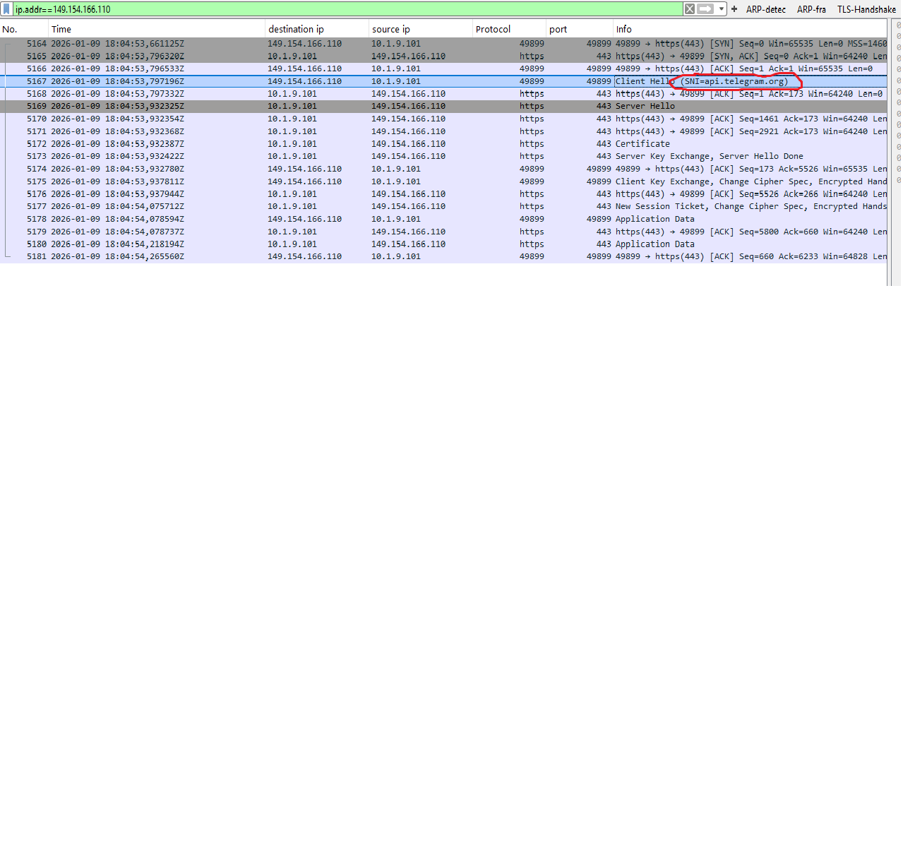**

**TLS handshake with api.telegram.org at 18:04:53 (ports 443 and 49899).**

**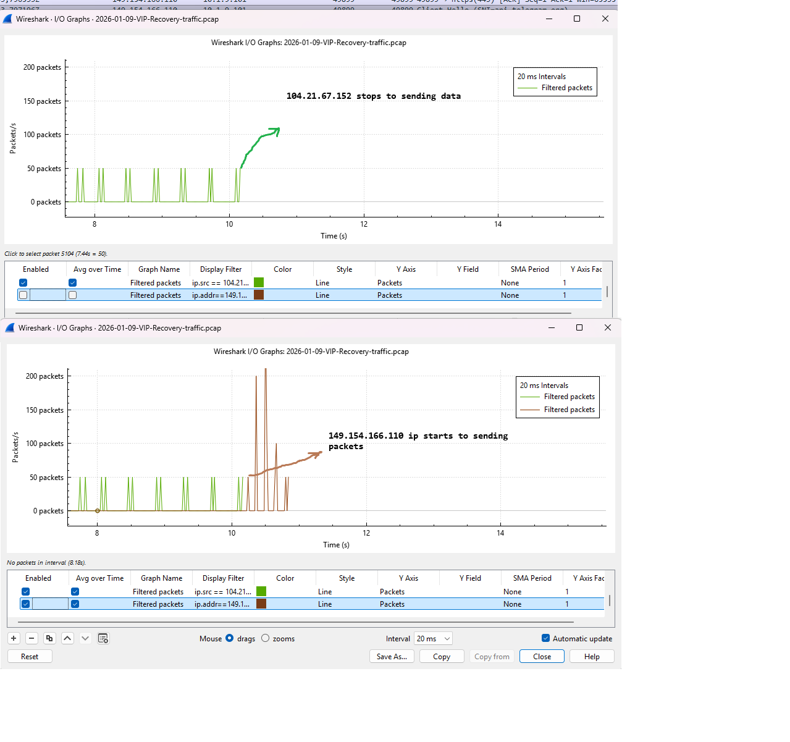**

**Top: 104.21.67.152 stops sending data at 18:04:53. Bottom: 149.154.166.110 starts at the same time.**

****

**After the 6-second gap,  (162.254.34.31) connected on port 587 (SMTP).**

****

**Using Wireshark's \*\*Follow TCP Stream\*\*, we see the AUTH LOGIN command:**

**AUTH login cmVqdlw1wQGVyYXFyb24uc2hvcA==**

**Password cmFYUmFzcWw1bzdN**

**They are Base64. Let's decode:**

**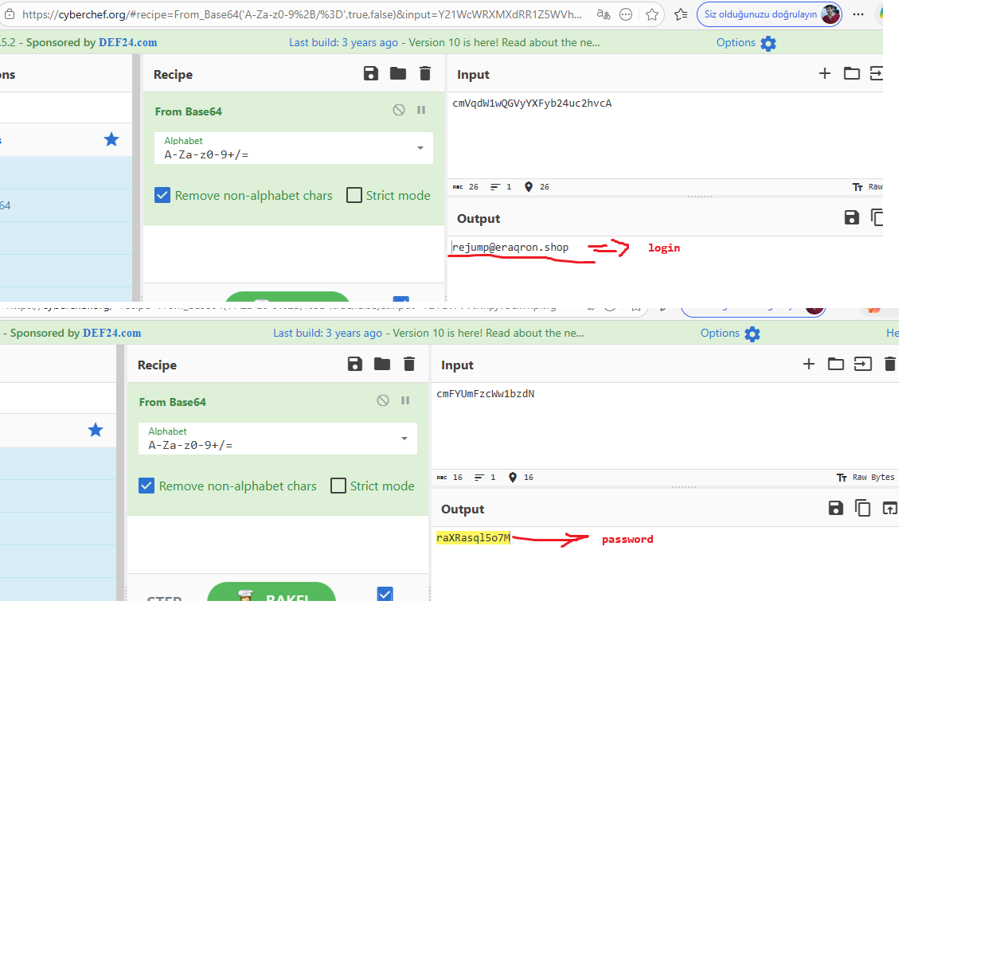**

**Username | `cmVqdvlwQGVyYXFyb24uc2hvCA` | `rejump@eraqron.shop`**

**Password | `cmFYUmFzcIwlzbzDN` | `raXRasql507M`**
**Authentication successful\*\* – it now has access to send emails through `eraqron.shop`**
**Wireshark's File---> Export Objects (IMF) feature allows us to extract emails from SMTP traffic.**

**We used it to:**
**1. Recover the emails sent by the malware**
**2. See what data was stolen**
**3. Prove that exfiltration happened**
**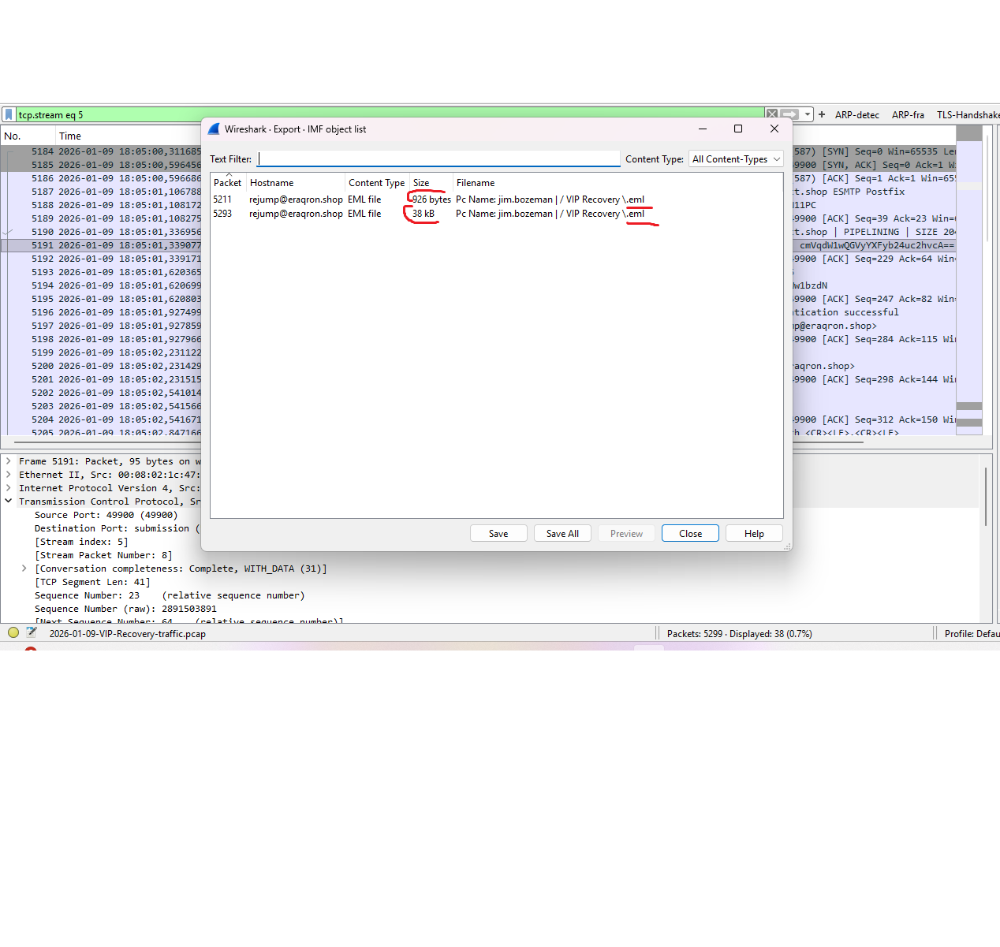**

**We found two emails:**
**- 5211: 926 bytes (small, probably metadata)**
**- 5293: 38 kB – contained the victim's system information!**
**\*\*Exfiltrated\*\* system information via SMTP**
**If we check I/O Graphs of 162.254.34.31 `eraqron.shop`;**
**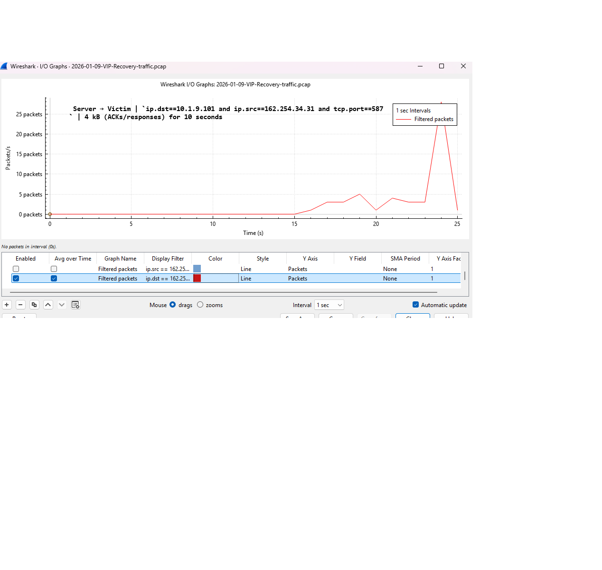**

**What this means:**
**- The server (162.254.34.31) is responding to the victim's SMTP commands.**
**- These are protocol messages – not the stolen data itself.**
**- The actual exfiltrated data (38 kB) was sent from victim to server, which is not shown here.**
**Note : In here I wasn't familiar with EML files at first, so I did some research and learned how to extract base64-encoded attachments.**
**With some help from AI for the syntax about commands!**
**sed -n '/^Content-Transfer-Encoding: base64/,/^--/p' email.eml | tail -n +2 | head -n -1 > ek.b64**
**base64 -d ek.b64 > extracted\_file**
**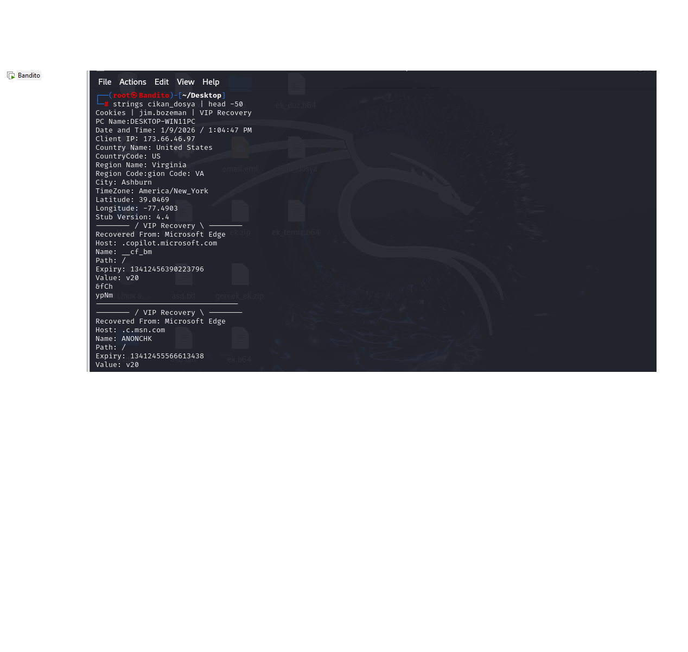**

**Exfiltrated Data Analysis**

**System Information**

**| Data | Value |**

**|------|-------|**

**| User | jim.bozeman |**

**| PC Name | DESKTOP-WIN11PC |**

**| Public IP | 173.66.46.97 |**

**| Location | Ashburn, Virginia, US |**

**| Malware Version | Stub 4.4 |  ------> ""Next Step we search on google Stub 4.4""**

**Browser Cookies (Microsoft Edge)**

**| Host | Cookie | Purpose | Risk |**

**|------|--------|---------|------|**

**| .copilot.microsoft.com | \_\_cf\_bm | Cloudflare bot management | Copilot session hijack |**

**| .c.msn.com | ANONCHK | Anonymity check | MSN/Outlook access |**

**| .c.bing.com | MR | Referrer | Bing search history |**

**| .c.msn.com | MR | Referrer | MSN session data |**

**\*\*This confirms that the malware stole both system information and browser cookies, putting the victim's Microsoft account and online activity at risk.**
**[What is Stub version 4.4](images/stub4.4.png)**

**🧬 Hybrid Analysis – Malware Behavior**
**I uploaded the extracted file to Hybrid Analysis and got the following results:**
**!\[Hybrid Analysis](images/hybrid-analysis.png)**
**| Category | Finding | Matches Our Analysis |**
**|----------|---------|----------------------|**
**| Spyware | POSTs data to webserver | ✅ SMTP exfiltration |**
**| Fingerprint | Identifies external IP | ✅ checkip.dyndns.org |**
**| Network | Contacts 3 domains/hosts | ✅ cubbit.eu, Firebase, Telegram |**
**| Evasive | Marks file for deletion | ✅ Anti-forensics |**
**| Persistence | Writes to remote process | ✅ Process injection |**

**MITRE ATT\&CK: 55 techniques, 10 tactics mapped.**
**This confirms that the file is malicious and matches the behavior we observed in the PCAP.**
**In Hybrid Analysis there is a 256SHA code; if we write the filter '4b7a405d2d1a9411a60f5316c9a77c64955683686aec9d2aa74527d177f6ada6' ,**

                                          **VirusTotal Confirmation**

* **I searched the file hash on VirusTotal and got the following results:**

**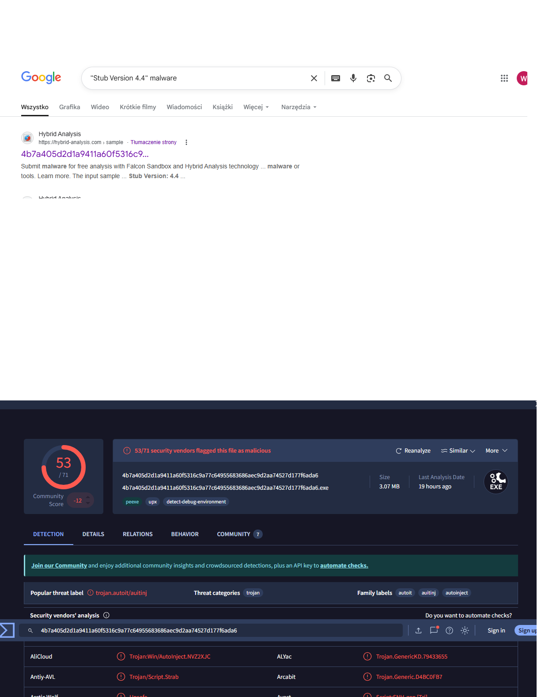**

* **Malware Family | FormBook / SnakeKeylogger**
* **File Size | 3.07 MB** 
* **Last Analysis | 19 hours ago**
* **Community Score | -12**

**Key vendor detections:**

**- ESET-NOD32: `Win32/Injector.Autoit.GIQ`**

**- Fortinet: `Autoit/FormBook.GIZltr`**

**- Sophos: `Mal/Aultinj-D`**

**- TrendMicro: `TrojanSpy.Win32.NEGASTEAL.YXGBTZ`**

* **This confirms that the downloaded files are indeed malware, specifically the FormBook/SnakeKeylogger family.**
* **The 53/71 detection rate and the vendor labels match the behavior we observed in the PCAP (system info theft, exfiltration, C2 communication).**

* **You can see mitre Attacking in the link : https://hybrid-analysis.com/sample/4b7a405d2d1a9411a60f5316c9a77c64955683686aec9d2aa74527d177f6ada6/69971dd291bf4626a207f0ef**

#                        **Final Thoughts**

**This analysis was conducted using only the PCAP file, with just one month of Wireshark experience.**  

**Every finding was verified through multiple sources (VirusTotal, Hybrid Analysis, passive DNS, and manual traffic inspection).**

**Mistakes may exist, and I welcome any feedback to improve.**  

**This report is not just an analysis—it's a step in my learning journey.**

**BlackOclock** 

**February 2026**

